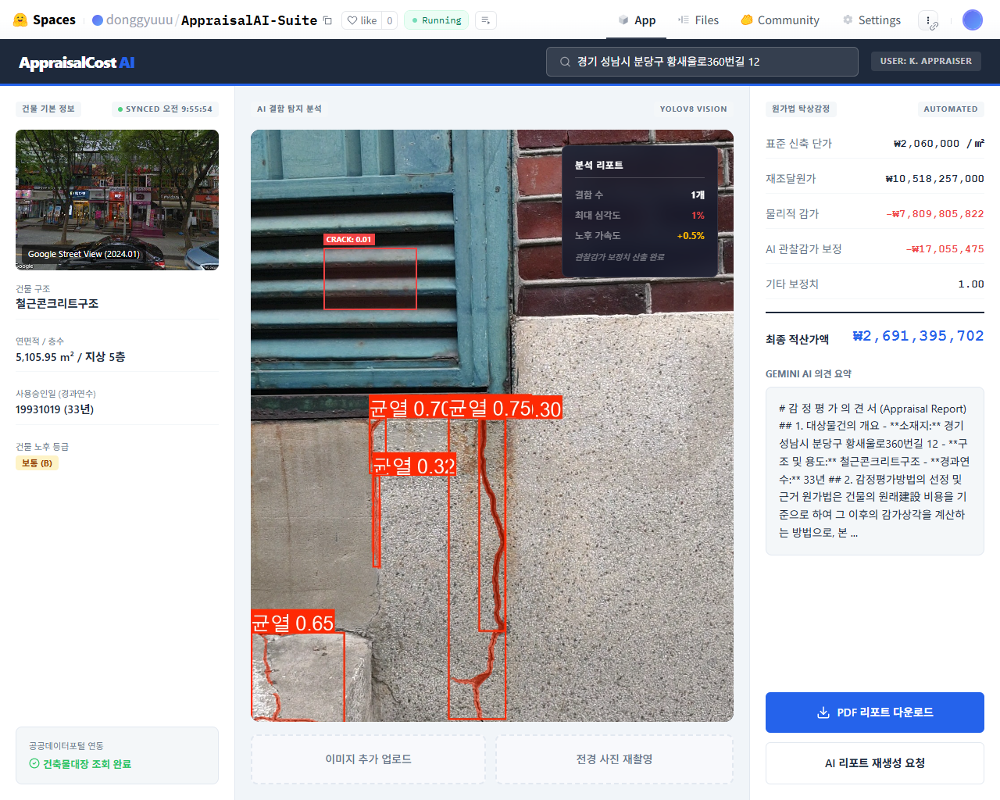
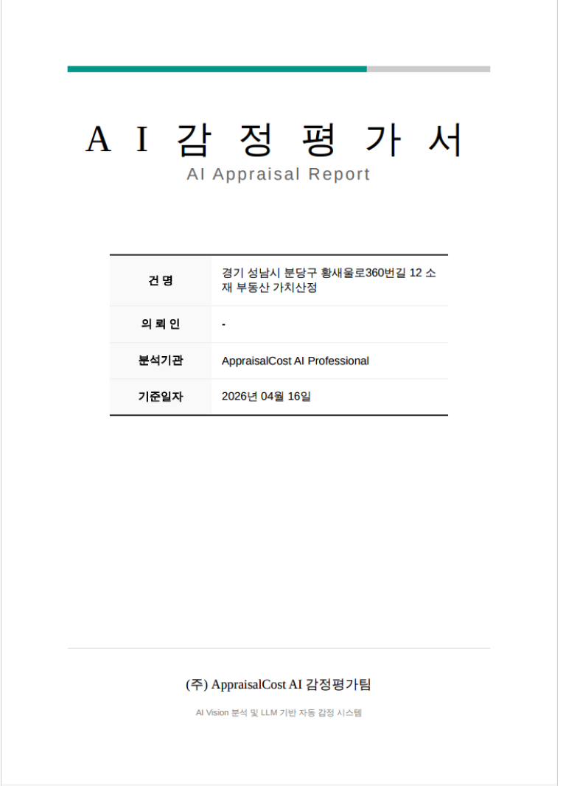

# AppraisalCost AI Suite

[](https://huggingface.co/spaces/donggyuuu/AppraisalAI-Suite)

AI 기반 건물 가치 산정 및 외벽 결함 분석 솔루션입니다. 건축물대장 데이터 조회, YOLOv8 기반의 결함 탐지, 그리고 원가법(Cost Approach)을 적용한 감정평가 로직을 통해 전문적인 AI 감정평가 리포트를 자동으로 생성합니다.

---

## 목차
- [배포 주소](#배포-주소)
- [주요 화면](#주요-화면)
- [핵심 기능](#핵심-기능)
- [기술 스택](#기술-스택)
- [아키텍처 개요](#아키텍처-개요)
- [프로젝트 구조](#프로젝트-구조)
- [설치 방법](#설치-방법)
- [환경변수 전체 가이드](#환경변수-전체-가이드)
- [주요 API](#주요-api)
- [모델 권장 (CPU 환경)](#모델-권장-cpu-환경)
- [트러블슈팅](#트러블슈팅)
- [향후 로드맵](#향후-로드맵)

---

## 배포 주소

**Hugging Face Spaces**: [https://huggingface.co/spaces/donggyuuu/AppraisalAI-Suite](https://huggingface.co/spaces/donggyuuu/AppraisalAI-Suite)

---

## 주요 화면

### 1. 메인 대시보드 및 AI 결함 탐지 분석

- 건축물대장 조회 및 YOLOv8 Vision AI를 활용한 결함(Crack) 탐지

### 2. AI 감정평가서 리포트 (PDF)

- 원가법 기반 적산가액 산출 및 LLM 기반 감정평가 의견서 자동 생성

---

## 핵심 기능

- **공공데이터 연동**: 건축물대장(표제부) API와 연동하여 대상 건물의 구조, 용도, 사용승인일 등 필수 정보를 자동 조회.
- **외벽 결함 분석**: YOLOv8m-seg 모델을 사용하여 건물의 균열(Crack) 등 결함을 탐지하고 심각도 및 노후 가속도를 수치화.
- **가치 산정 (원가법)**: 한국감정평가 실무 기준에 맞춘 내용연수 및 재조달원가를 바탕으로 감가수정을 거쳐 최종 **적산가액**을 산출.
- **LLM 의견서 자동화**: 산출된 가치 데이터와 결함 분석 결과를 종합하여 Gemini/Llama 등 AI를 통해 감정평가사의 전문 의견서를 자동 작성.
- **전문 PDF 리포트 생성**: Playwright 기반의 PDF 렌더링 엔진을 통해 고품질의 감정평가서 문서를 생성 및 다운로드.

---

## 기술 스택

### Frontend


### Backend


### AI & LLM


### Deployment


---

## 아키텍처 개요

1. **Client (React)**: 사용자가 주소를 입력하고 건물 사진을 업로드합니다.
2. **Backend (FastAPI)**: 
   - 공공데이터포털 API를 호출하여 건물 스펙을 불러옵니다.
   - 업로드된 이미지를 YOLOv8 모델에 통과시켜 결함을 분석(Vision AI)합니다.
   - 건물 스펙과 분석 결과를 바탕으로 원가법 감정평가 알고리즘을 수행합니다.
   - LLM API를 호출하여 감정 의견을 작성하고, 모든 데이터를 결합해 리포트용 HTML 템플릿을 완성합니다.
3. **PDF Generator**: Playwright를 이용해 생성된 HTML을 한글 깨짐 없이 PDF로 렌더링하여 클라이언트에게 반환합니다.

---

## 프로젝트 구조

```text
AppraisalCostMethodLLM/
├── backend/
│   ├── app/
│   │   ├── api/            # API 라우터 (analysis, appraisal, registry)
│   │   ├── core/           # 설정 및 공통 로직
│   │   ├── models/         # Pydantic 데이터 모델
│   │   ├── services/       # 비즈니스 로직 (감정평가, AI 추론 등)
│   │   ├── templates/      # 리포트 생성을 위한 Jinja2 HTML 템플릿
│   │   └── utils/          # 유틸리티 (로거 등)
│   └── requirements.txt    # 백엔드 의존성
├── frontend/
│   ├── public/             # 정적 리소스
│   ├── src/                # React 컴포넌트 및 소스코드
│   ├── package.json        # 프론트엔드 의존성
│   └── vite.config.ts      # Vite 설정
├── Dockerfile              # Hugging Face 배포용 도커 파일
└── README.md               # 프로젝트 가이드
```

---

## 설치 방법

### 1. Repository Clone
```bash
git clone https://github.com/your-repo/AppraisalCostMethodLLM.git
cd AppraisalCostMethodLLM
```

### 2. Backend 환경 설정
```bash
cd backend
python -m venv venv
source venv/bin/activate  # Windows: venv\Scripts\activate
pip install -r requirements.txt

# PDF 생성을 위한 Playwright 브라우저 의존성 설치 (필수)
playwright install chromium --with-deps
```

### 3. Frontend 환경 설정
```bash
cd ../frontend
npm install
```

### 4. 로컬 서버 실행
- Backend 실행 (`backend` 디렉터리)
  ```bash
  uvicorn app.main:app --reload --port 8000
  ```
- Frontend 실행 (`frontend` 디렉터리)
  ```bash
  npm run dev
  ```

---

## 환경변수 전체 가이드

프로젝트 실행을 위해 루트 또는 프론트엔드/백엔드 최상단에 `.env` 파일을 생성하고 아래 변수들을 설정합니다.

```env
# [AI Studio / LLM Settings]
# Gemini AI API 호출을 위한 인증 키입니다. AI Studio UI를 통해 발급받을 수 있습니다.
GEMINI_API_KEY="YOUR_GEMINI_API_KEY"

# [Deployment Settings]
# 애플리케이션이 호스팅되는 URL입니다. 자체 참조 링크, OAuth 콜백 등에 사용됩니다.
APP_URL="YOUR_APP_URL"
PORT="7860" # Cloud 환경 또는 Docker 컨테이너의 포트 설정
```

---

## 주요 API

- **`GET /api/v1/registry/search`** : 입력된 주소를 기반으로 공공데이터 건축물대장 정보를 조회합니다.
- **`GET /api/v1/registry/info`** : 조회된 건축물의 세부 스펙(용도, 연면적, 층수 등)을 반환합니다.
- **`POST /api/v1/analysis/detect`** : 건물 외벽 이미지를 업로드받아 YOLOv8 모델로 결함 및 균열을 탐지합니다.
- **`POST /api/v1/appraisal/calculate`** : 건물 정보와 AI 분석 결과를 바탕으로 원가법(Cost Approach) 적산가액을 계산합니다.
- **`POST /api/v1/appraisal/report`** : LLM(Gemini)을 활용해 자동화된 AI 감정평가 의견서를 텍스트로 생성합니다.
- **`POST /api/v1/appraisal/export/pdf`** : 모든 결과를 취합하여 최종 감정평가 리포트를 PDF 형식으로 렌더링하고 다운로드합니다.

---

## 모델 권장 (CPU 환경)

GPU가 지원되지 않는 환경(예: 로컬 개발 환경 또는 일반 Docker 컨테이너)에서는 경량화된 모델 사용을 권장합니다.
- **Vision (결함 탐지)**: 
  - 기본 제공되는 `yolov8m-seg.pt` (Medium) 모델도 동작하나, CPU 추론 속도를 높이려면 **`yolov8n-seg.pt` (Nano)** 모델로 변경하여 사용하는 것을 추천합니다.
- **LLM (의견서 생성)**: 
  - 로컬에서 추론할 경우(Ollama 등) 메모리 제약이 크므로 `gemma:2b` 또는 `llama3:8b` (양자화 버전)을 권장합니다. 
  - 속도와 품질을 위해 가급적 **Gemini API** 같은 외부 클라우드 LLM 사용을 기본으로 구성했습니다.

---

## 트러블슈팅

### PDF 리포트 생성 시 한글 폰트 미인식 (글깨짐) 문제
- **문제 발생**: 초기에는 Python의 표준 PDF 라이브러리(ReportLab 등) 및 wkhtmltopdf를 활용하여 AI 감정평가서를 출력하려 했으나, 한글 폰트가 제대로 인코딩되지 않고 네모 박스(□□□)로 깨지는 현상이 빈번하게 발생했습니다.
- **해결 방안 (`Playwright` 도입)**: 
  - HTML 기반으로 리포트 레이아웃 구조를 잡고 `Jinja2` 템플릿 엔진으로 데이터를 렌더링한 후, **`Playwright`**를 활용하여 Headless Chromium 브라우저에서 화면을 직접 PDF로 출력하는 방식으로 아키텍처를 변경했습니다.
  - 브라우저 렌더링 엔진을 활용하게 됨으로써 웹 폰트(Noto Sans KR, 맑은 고딕 등)와 복잡한 CSS 스타일 및 레이아웃을 완벽하게 인식하고 유지할 수 있게 되었습니다.
  - 배포 환경에서도 이를 매끄럽게 지원하기 위해 `Dockerfile` 내에 `playwright install chromium --with-deps` 명령어를 추가하여 OS 레벨의 폰트/브라우저 의존성을 완벽히 해결했습니다.

---

## 향후 로드맵

- [ ] **다중 이미지 지원**: 단일 이미지가 아닌 여러 각도의 건물 사진을 일괄 업로드 및 분석하는 기능.
- [ ] **수익환원법/거래사례비교법 도입**: 현재 원가법 외에도 다양한 감정평가 기법을 추가하여 정확도 향상.
- [ ] **모바일 및 반응형 최적화**: 현장 조사자가 태블릿이나 모바일 기기에서도 손쉽게 사용할 수 있도록 UI/UX 고도화.
- [ ] **보고서 커스터마이징**: 평가사 개인/기업별 커스텀 로고 워터마크 삽입 및 양식 변경 기능.
